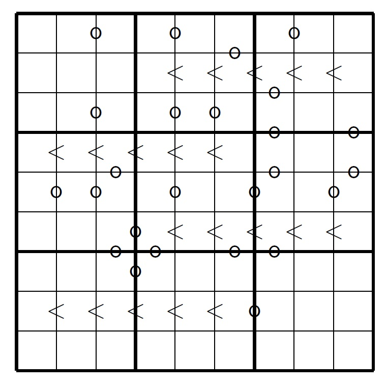

# course-automated-reasoning

Coursea's automatic reasoning course assignments

## Week 2

Week 2 has four different practical assignments, below you'll find the
description of each of them.

### Filling trucks for a magic factory

 1. Eight trucks have to deliver pallets of obscure building blocks
    to a magic factory. Every truck has a capacity of 8000 kg and can
    carry at most eight pallets. 
    
    In total, the following has to be delivered:

    * Four pallets of nuzzles, each of weight 800 kg.
    * A number of pallets of prittles, each of weight 1100 kg.
    * Eight pallets of skipples, each of weight 1000 kg.
    * Ten pallets of crottles, each of weight 2500 kg.
    * Twenty pallets of dupples, each of weight 200 kg.

    Additionally:

    * Skipples need to be cooled; only three of the 
    eight trucks have the facility for cooling skipples.
    * Nuzzles are very valuable; to distribute the risk of
      loss no two pallets of nuzzles may be in the same truck.

    Investigate what is the maximum number of pallets of prittles
    that can be delivered.

    (Hint: if you do not use the maximize command, you may run the
     tool several times and do a binary search to find the right value)

 2. Consider all requirements from Question 1, but now with the following
    additional requirement.

    Prittles and crottles are an explosive combination: they are not allowed
    to be put in the same truck.
    Again, investigate what is the maximum number of pallets of prittles that
    can be delivered.

### A sudoku variant

 1. Below you see a SUDOKU variant.

    

    Again the numbers 1 to 9 should be filled, in such a way that each number
    occurs exactly once in every row, every column and every 3x3 block. But
    now there are no numbers given, only symbols '<' and 'o'. The symbol 
    '<' means that the number left from it should be less than the number right
    from it.

    The symbol 'o' means that the two numbers on both sides are consecutive:
    they differ by exactly one. For border lines not containing a symbol '<'
    or 'o' nothing is known. 

    Just like normal sudoku this puzzle has a unique solution (as was 
    figured out by SMT solving). The goal is to find it. Doing this by hand
    looks quite impossible (you may try!), but solving it by SMT is much 
    more feasible. Can you do this?

    As the answer you should give the 9 digit number formed by the lowest line. 

